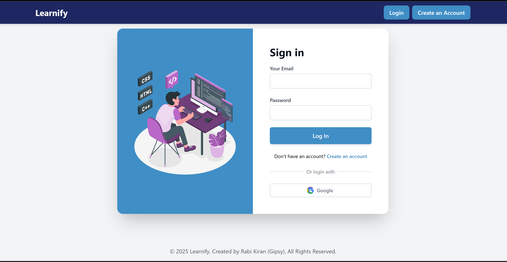
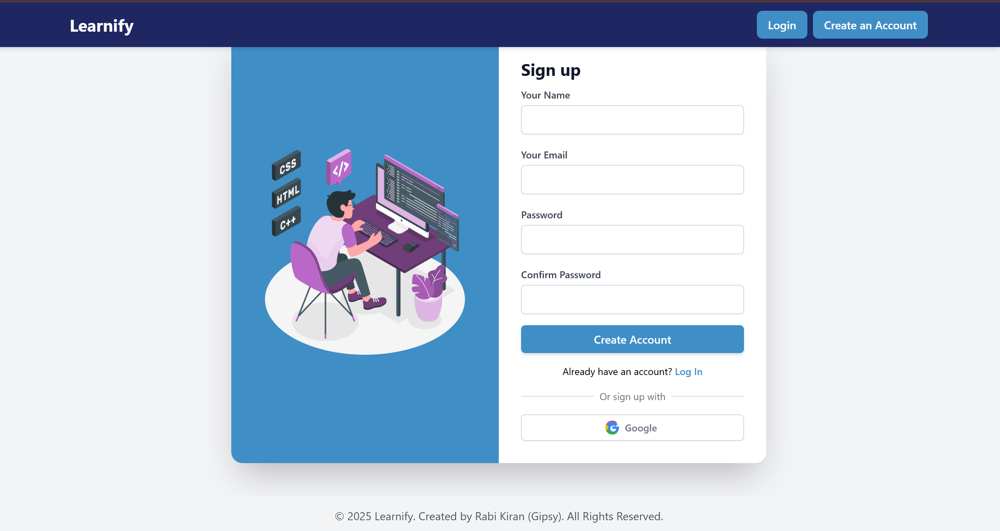
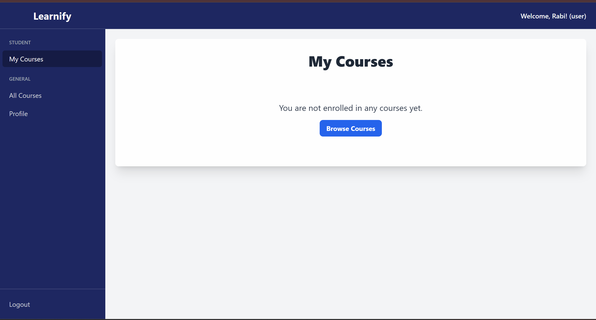
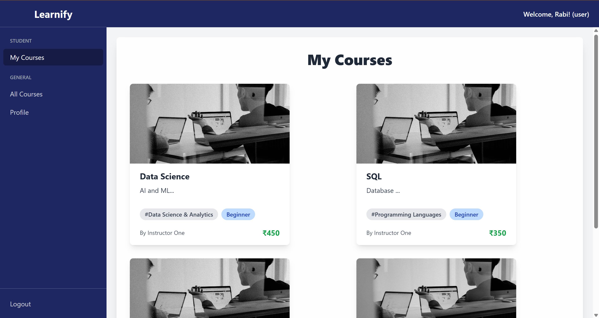
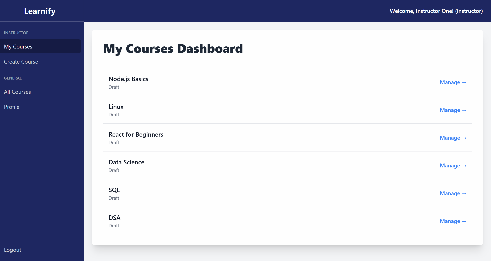
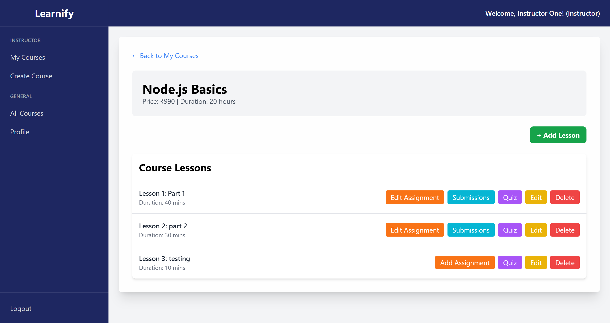
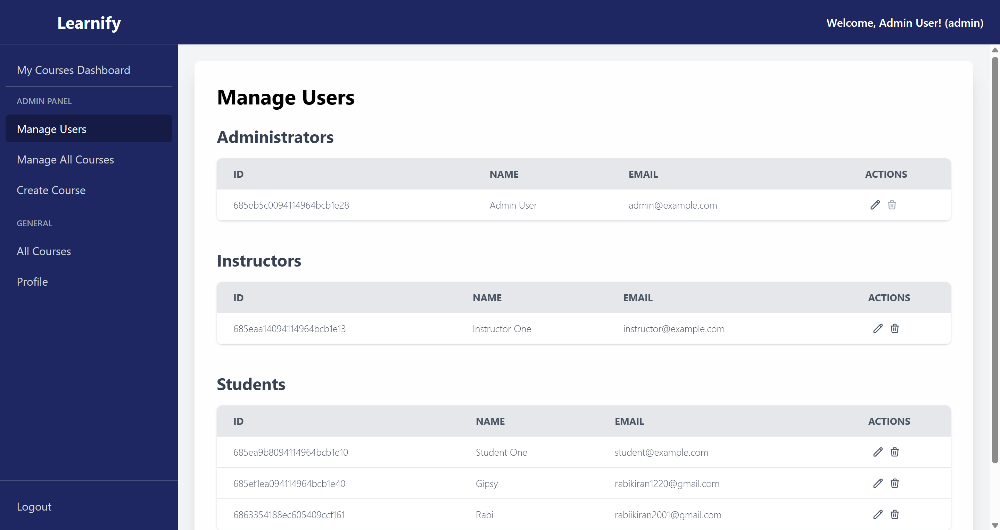
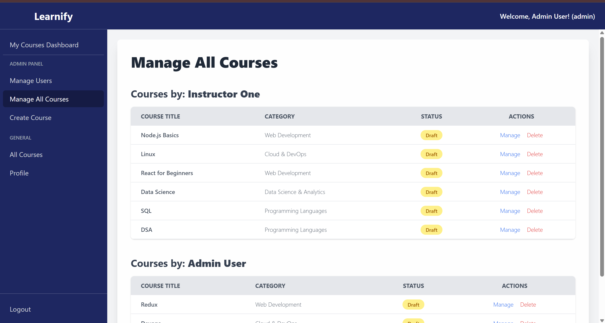

# Learnify – MERN Stack Online Learning Platform

A comprehensive, full-stack **online learning platform** built using the **MERN** stack (MongoDB, Express, React, Node.js). Learnify provides a powerful role-based system for **Students**, **Instructors**, and **Administrators** to deliver and consume educational content.

[](https://opensource.org/licenses/MIT)

**🔗 Live Demo:** https://learnify-three-black.vercel.app/

---

## ✨ Key Features

### 🧑‍🎓 Student
- Browse and enroll in courses
- View video/PDF/image-based lessons
- Track progress
- Take quizzes and submit assignments

### 🧑‍🏫 Instructor
- Create and manage courses
- Upload lessons (video, PDF, slides)
- Create quizzes and assignments
- Manage enrolled students

### 👑 Admin
- Full user management (promote/demote/delete users)
- View and manage all courses and categories
- Access instructor features

### 🔐 Authentication
- Secure JWT-based authentication
- Google OAuth login using Passport.js
- Role-based route protection

### 📚 Course System
- Full CRUD for courses, lessons, categories, and quizzes
- Video via React Player, PDFs via react-pdf-viewer
- Image-based slides with Swiper.js

### 📊 Student Tracking
- Progress tracking (mark lessons complete)
- Conditional unlocking of next content
- Quiz scoring and assignment feedback

### 💎 Modern UI
- Responsive UI with Tailwind CSS
- Clean dashboards for each role
- Rich-text editing with react-quill

---

## 📸 Screenshots

### 🔑 Authentication
| Login Page | Register Page |
|------------|----------------|
|  |  |

### 🧑‍🎓 Student Interface
| Dashboard | Course Learning |
|-----------|------------------|
|  |  |

### 🧑‍🏫 Instructor Panel
| My Courses | Manage Course |
|------------|----------------|
|  |  |

### 👑 Admin Panel
| Users | Courses |
|--------|---------|
|  |  |

---

## 🛠️ Tech Stack

### Frontend
- React + Vite
- Redux Toolkit + RTK Query
- React Router
- Tailwind CSS
- react-quill (Rich text editor)
- swiper (Slideshow)
- @react-pdf-viewer

### Backend
- Node.js + Express
- MongoDB + Mongoose
- JWT + Passport.js (Google OAuth)
- Cloudinary (Image/file upload)
- Nodemailer (Email notifications)

### Deployment
- **Frontend**: Vercel  
- **Backend**: Render

---

## 🚀 Run Locally

From the root of the project, run the following command to start both backend and frontend:

```bash
npm run dev

🧪 Environment Setup
server/.env
NODE_ENV=development
PORT=5000
MONGODB_URI=your_mongodb_connection_string
JWT_SECRET=your_jwt_secret
SESSION_SECRET=your_session_secret

CLOUDINARY_CLOUD_NAME=your_cloudinary_name
CLOUDINARY_API_KEY=your_cloudinary_key
CLOUDINARY_API_SECRET=your_cloudinary_secret

GOOGLE_CLIENT_ID=your_google_client_id
GOOGLE_CLIENT_SECRET=your_google_client_secret

SMTP_HOST=smtp.gmail.com
SMTP_PORT=587
SMTP_USER=your_gmail_address
SMTP_PASS=your_gmail_app_password

client/.env
VITE_API_BASE_URL=http://localhost:5000
VITE_GOOGLE_CLIENT_ID=your_google_client_id

🚢 Deployment Guide
🔧 Backend (Render)
Root Directory: server

Build Command: npm install

Start Command: npm start

Environment Variables: same as in server/.env

💻 Frontend (Vercel)
Framework: Vite

Root Directory: client

Environment Variables:

VITE_API_BASE_URL: URL of Render backend

VITE_GOOGLE_CLIENT_ID: your Google client ID

👤 Author
Rabi Kiran (Gipsy)
Full Stack Developer | MERN Enthusiast
